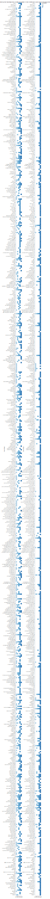

## Visualization 4

{(aim|}
To understand the distribution of the `timePeriods` within which points of interest were founded and dissolved.
{|aim)}

{(vistype|}
Heatmap
{|vistype)}

```python
import altair as alt

places = ('https://raw.githubusercontent.com/SwanseaU-TTW/csc337_coursework1/master/pleiades-places-latest.csv')

def heatMap(column):
    return (
        alt.Chart(places).mark_rect().transform_calculate(
            groupedDate=f'datum.{column} < -550 ? "A" : datum.{column} < -330 ? "C" : datum.{column} < -30 ? "H" : datum.{column} < 300 ? "R" : "L"'
        ).encode(
            alt.X("groupedDate:O", sort=['A', 'C', 'H', 'R', 'L'], title=f'{column}(grouped)'),
            y='featureTypes:N',
            color=alt.Color('groupedDate:O', sort=['A', 'C', 'H', 'R', 'L']),
            tooltip=['count()']
        )
    )


alt.hconcat(
    (heatMap('minDate') | heatMap('maxDate'))
).properties(
    title='Heatmaps showing what featureTypes have a minDate and maxDate in what timePeriods for each record on the places pleiades dataset'
).configure_title(orient='top', anchor='middle')
```



---

{(vismapping|}

Given that date is minDate or maxDate

x position
: date (grouped and sorted according to the group)

y position
: featureTypes

color
: date (grouped and sorted according to the group)

tooltip
: count of records

{|vismapping)}

{(dataprep|}
The data has been grouped to match the pleaides README on `timePeriods` such that the records fall into the following bins _"...'A' (1000-550 BC), 'C' (550-330 BC), 'H' (330-30 BC), 'R' (AD 30-300), 'L' (AD 300-640)"_.
{|dataprep)}

{(limitations|}
The visualization takes up to much space. This could be improved by using a smaller sample size or possibly, grouping the `featureTypes` into a smaller list of sub-categories such that its records are easier to see at a glance. Data processing to split the `featureTypes` column by the delimeter could also help.
{|limitations)}
